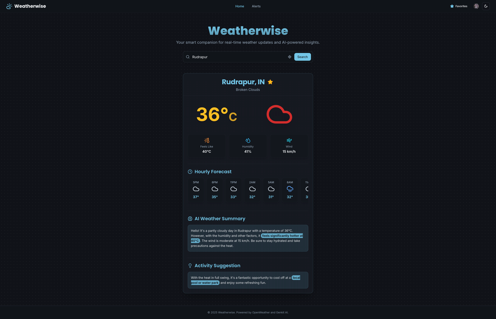

# Weatherwise: Intelligent Weather & Alert Platform

<div align="center">


</div>

<br/>

<p align="center">
  
</p>

**Weatherwise** is a modern, full-stack web application that provides real-time weather data, AI-powered insights, and a highly customizable, intelligent alert system. It's built with a modern tech stack designed for performance, scalability, and a superior developer experience.

---

## 📚 Table of Contents

- [✨ Core Features](#-core-features)
- [🧠 Key Architectural Decisions](#-key-architectural-decisions)
- [🛠️ Tech Stack](#️-tech-stack)
- [📂 Project Structure](#-project-structure)
- [🚀 Running Locally](#-running-locally)
- [☁️ Deployment (Free Hosting)](#️-deployment-free-hosting)
- [⏰ Setting up Automatic Hourly Alerts (Cron Job)](#-setting-up-automatic-hourly-alerts-cron-job)
- [❓ Frequently Asked Questions](#-frequently-asked-questions)
- [💻 Recommended VS Code Extensions](#-recommended-vs-code-extensions)

---

## ✨ Core Features

*   **Dynamic Weather Dashboard:** Get real-time weather data for any city worldwide or automatically detect the user's location via browser geolocation or IP lookup.
*   **AI-Powered Insights:** The application leverages Google's Gemini model via Genkit to provide users with conversational weather summaries, creative activity suggestions, and intelligent email subject lines.
*   **Intelligent, Customizable Alerts:**
    *   **AI-Driven Decisions:** Instead of rigid rules, the AI analyzes weather conditions to decide if an alert is significant enough to send.
    *   **Custom Schedules:** Users can define specific days and times to receive alerts, all managed within their chosen timezone.
    *   **Adjustable Sensitivity:** Control alert frequency with "Maximum," "Balanced," or "Minimal" settings to prevent notification fatigue.
    *   **Secure Cron Job Integration:** A secure webhook endpoint allows for reliable, hourly alert checks triggered by an external scheduler.
*   **Secure User Authentication:** Full sign-up, sign-in, and profile management powered by Clerk.
*   **Modern, Responsive UI:** Built with a modern, responsive UI using Tailwind CSS and ShadCN UI, featuring light and dark modes and a focus on a clean user experience.

---

## 🧠 Key Architectural Decisions

This project was designed with specific architectural patterns to ensure it is performant, resilient, and maintainable.

*   **Server-First Approach with Next.js App Router:**
    *   **Why:** By using **Server Components** and **Server Actions** as the default, we minimize the amount of JavaScript sent to the client. This results in faster initial page loads and a snappier user experience, as the heavy lifting is done on the server.
    *   **Example:** The primary `fetchWeatherAndSummaryAction` is a Server Action, allowing the client to call server-side logic without needing to define a separate API endpoint.

*   **Resilient, Multi-Key API Services:**
    *   **Why:** Services like OpenWeatherMap and Google Gemini often have free tiers with rate limits. To prevent a single exhausted API key from taking down the entire application, the backend services for both are designed to accept multiple API keys.
    *   **How:** If a call with one key fails due to a quota or invalid key error, the service automatically and transparently retries the request with the next available key. Failing keys are temporarily put in a "penalty box" to improve performance.

*   **Secure User Data with Clerk Private Metadata:**
    *   **Why:** A user's alert preferences (city, schedule, frequency) are sensitive and should not be stored in a place the client can easily read or manipulate, like `localStorage`.
    *   **How:** We leverage Clerk's `privateMetadata` field, a secure, server-side storage location associated with each user. This keeps their preferences safe and ensures they are only accessed and modified through secure Server Actions.

*   **Decoupled Alert Triggering with Cron Jobs:**
    *   **Why:** The system needs to check for alerts for all users every hour, regardless of whether they are using the app. Relying on client-side timers is unreliable.
    *   **How:** We expose a secure API endpoint (`/api/cron`) that is protected by a secret key. This endpoint is designed to be called by an external, reliable scheduling service (a "cron job"). This decouples the alert-checking logic from the main application's user-facing parts and ensures it runs consistently.

---

## 🛠️ Tech Stack

| Category      | Technology                                                                                                                              | Rationale & Key Usage                                                                                                                                                           |
| :------------ | :-------------------------------------------------------------------------------------------------------------------------------------- | :------------------------------------------------------------------------------------------------------------------------------------------------------------------------------ |
| **Framework** | [**Next.js (App Router)**](https://nextjs.org/)                                                                                         | Utilizes **Server Components** by default to minimize client-side JavaScript and improve load times. The App Router provides a robust foundation for routing and layouts.            |
| **AI**        | [**Google Gemini**](https://deepmind.google/technologies/gemini/) & [**Genkit**](https://firebase.google.com/docs/genkit)                | Genkit orchestrates calls to the Gemini model for all AI tasks, including weather summaries, city name correction, and the core logic for the intelligent alert system.       |
| **Language**  | [**TypeScript**](https://www.typescriptlang.org/)                                                                                       | Ensures type safety across the entire application, from front-end components to back-end server actions, reducing runtime errors and improving developer productivity.     |
| **Styling**   | [**Tailwind CSS**](https://tailwindcss.com/) & [**ShadCN UI**](https://ui.shadcn.com/)                                                     | A utility-first CSS framework for rapid, custom UI development, paired with a set of beautifully designed, accessible, and composable components.                               |
| **Auth**      | [**Clerk**](https://clerk.com/)                                                                                                         | Handles user authentication, session management, and provides a secure foundation for user-specific features like alert preferences.                                         |
| **Data**      | [**OpenWeatherMap API**](https://openweathermap.org/api)                                                                                | The primary source for all weather and geocoding data. The backend includes resilient, multi-key-aware services for fetching data.                                        |
| **Emails**    | [**Nodemailer**](https://nodemailer.com/)                                                                                               | A reliable module for sending dynamically generated, HTML-based email alerts from the server. The templates are dark-themed and designed for modern email clients.        |
| **Deployment**| [**Firebase App Hosting**](https://firebase.google.com/docs/app-hosting)                                                                | Provides a seamless, fully-managed deployment solution with auto-scaling, global CDN, and integrated security features.                                                      |

---

## 📂 Project Structure

A brief overview of the key directories in this project:

```
/
├── public/                 # Static assets like images and fonts
├── src/
│   ├── app/                # Next.js App Router pages and layouts
│   │   ├── (main)/         # Main application pages (Home, Alerts, Profile)
│   │   ├── api/            # API routes (e.g., /api/cron for the cron job)
│   │   └── actions.ts      # Server Actions for client-server communication
│   ├── ai/                 # All Genkit AI-related code
│   │   └── flows/          # AI flows for specific tasks (summaries, alerts)
│   ├── components/         # Reusable React components
│   │   └── ui/             # ShadCN UI components
│   ├── hooks/              # Custom React hooks (e.g., useFavorites)
│   ├── lib/                # Shared utilities, types, and constants
│   └── services/           # Backend services (weather, email, caching)
└── .env                    # Local environment variables (API keys, etc.)
```

---

## 🚀 Running Locally

Follow these steps to get the project running on your local machine.

#### 1. Prerequisites
*   [**Node.js**](https://nodejs.org/) (v18 or later recommended)
*   [**Git**](https://git-scm.com/)

#### 2. Clone the Repository
```bash
git clone <YOUR_REPOSITORY_URL>
cd <project-directory>
```

#### 3. Configure Environment Variables
> **⚠️ IMPORTANT:** This is the most critical step. The application **will not start** without the required API keys.

1.  In the root directory, create a new file named `.env`.
2.  Add the following variables, replacing the placeholder values with your own keys.

| Variable                          | Description                                                                                                                                                             | How to Get It                                                                                                                                                                |
| :-------------------------------- | :---------------------------------------------------------------------------------------------------------------------------------------------------------------------- | :--------------------------------------------------------------------------------------------------------------------------------------------------------------------------- |
| `NEXT_PUBLIC_CLERK_PUBLISHABLE_KEY` | Public key for Clerk authentication.                                                                                                                                    | Go to your **Clerk Dashboard** -> **API Keys**.                                                                                                                              |
| `CLERK_SECRET_KEY`                | Secret key for Clerk authentication.                                                                                                                                    | Go to your **Clerk Dashboard** -> **API Keys**.                                                                                                                              |
| `NEXT_PUBLIC_OPENWEATHER_API_KEYS`| One or more API keys for OpenWeatherMap. **Multiple keys can be added, separated by commas**, for resilience.                                                              | Sign up on the **OpenWeatherMap** website and subscribe to the free "Current Weather and Forecasts" plan.                                                                    |
| `GEMINI_API_KEYS`                 | One or more API keys for the Google Gemini model. **Multiple keys can be added, separated by commas**, for resilience.                                                     | Go to **Google AI Studio** and click "Get API key".                                                                                                                          |
| `CRON_SECRET`                     | A secret password of your choice to protect the cron job endpoint. Should be a long, random string.                                                                       | Create your own secure password.                                                                                                                                             |
| `EMAIL_USER`                      | Your full Gmail address for sending email alerts.                                                                                                                         | This is your standard Gmail account (e.g., `youremail@gmail.com`).                                                                                                           |
| `EMAIL_PASSWORD`                  | A **16-digit App Password** for your Gmail account. Your regular password will not work.                                                                                  | Go to your **Google Account settings** -> **Security** -> **2-Step Verification**. Scroll down to "App passwords" and generate a new one. [See Google's instructions](https://support.google.com/accounts/answer/185833). |
| `EMAIL_FROM`                      | The email address alerts will appear to be sent from. Can be the same as `EMAIL_USER`.                                                                                    | Your choice, but usually the same as `EMAIL_USER`.                                                                                                                           |
| `NEXT_PUBLIC_BASE_URL`            | The public URL of your application.                                                                                                                                     | For local development, this is `http://localhost:3000`. For a deployed app, this will be your Firebase URL.                                                                  |

#### 4. Install Dependencies & Run
```bash
npm install
npm run dev
```

Your application should now be running at `http://localhost:3000`.

---

## ☁️ Deployment (Free Hosting)

This app is pre-configured for one-command deployment with **Firebase App Hosting**.

#### 1. Set Up Firebase
If you don't have them already, install the Firebase command-line tools and log in:
```bash
# Install the Firebase CLI globally
npm install -g firebase-tools

# Log in to your Google account
firebase login
```
You will also need to create a new project in the [Firebase Console](https://console.firebase.google.com/).

#### 2. Deploy the App
From your project's root directory, run the deploy command.
```bash
firebase deploy
```

#### 3. Configure Server Secrets
> **⚠️ CRITICAL STEP:** Your local `.env` file is **not** uploaded during deployment for security reasons. Your app **will not work** until you add your secrets to the Firebase environment.

1.  Go to your project in the [Firebase Console](https://console.firebase.google.com/).
2.  Navigate to the **App Hosting** section.
3.  In your backend's settings, find the **Secret Manager** section and add all the same secret keys (e.g., `CLERK_SECRET_KEY`, `GEMINI_API_KEYS`, etc.) that are in your local `.env` file.
4.  **Important:** Update the `NEXT_PUBLIC_BASE_URL` variable to your new public Firebase URL.

---

## ⏰ Setting up Automatic Hourly Alerts (Cron Job)

To enable automatic hourly alerts, you must set up a "cron job" that calls a secure API endpoint on your **deployed application**.

1.  **Set `CRON_SECRET` in your deployment environment:** Ensure you have added a secure, random `CRON_SECRET` in your Firebase project's Secret Manager.
2.  **Use a Scheduling Service:** Use a free external service like `cron-job.org` or a similar scheduler.
3.  **Configure the Job:**
    *   **URL / Endpoint:** `https://<YOUR_DEPLOYED_APP_URL>/api/cron`
    *   **Schedule:** Run **once every hour**.
    *   **HTTP Method:** `GET`
    *   **Custom Headers:** You must add an `Authorization` header with the value `Bearer <YOUR_CRON_SECRET>`.

### How to Verify Your Cron Job is Working

Check your application's logs in the Firebase Console. If you see the log message `[CRON-AUTH-SUCCESS] Cron job authorized successfully`, it's working!

---

## ❓ Frequently Asked Questions

**Will the app and alerts run 24/7 on Firebase?**

Yes. Once deployed, the app runs on Google's servers. The hourly alerts depend on the external cron job service you set up. As long as that service calls your app's `/api/cron` URL every hour, your alerts will be checked around the clock.

**If I close my computer, will the deployed app stop running?**

No. It is completely independent of your local machine.

---

## 💻 Recommended VS Code Extensions

This project includes a `.vscode/extensions.json` file. VS Code will automatically prompt you to install these recommended extensions, which improve the development experience.

*   **ESLint & Prettier:** For code quality and consistent formatting.
*   **Tailwind CSS IntelliSense:** Essential for working with Tailwind classes.
*   **Clerk & Google Cloud Code:** Official extensions for easier integration.
*   **DotENV & GitLens:** Quality-of-life improvements.
*   **Lucide Icons:** Easily search and preview icons.
