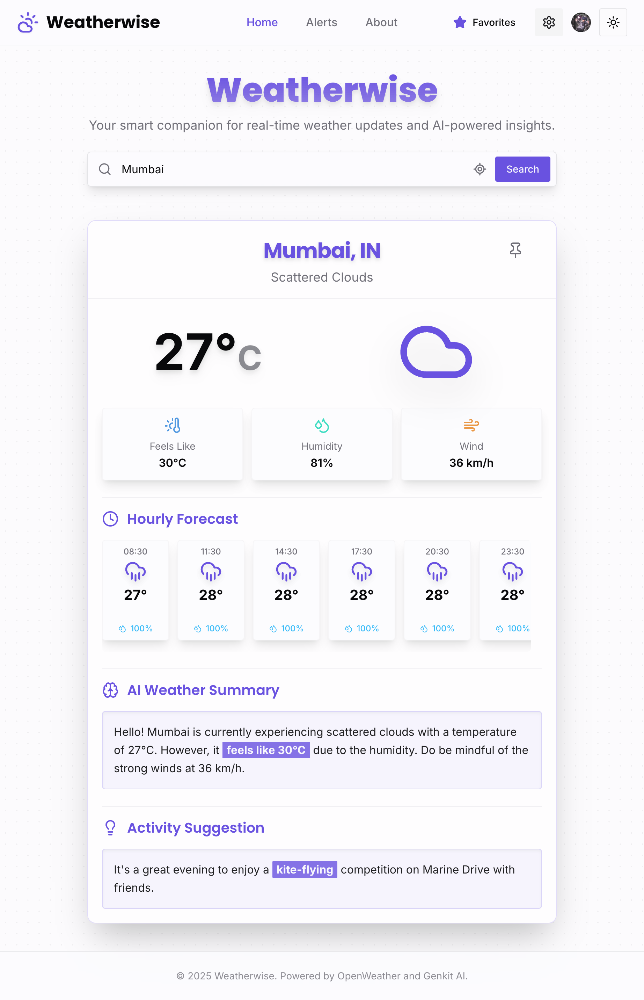
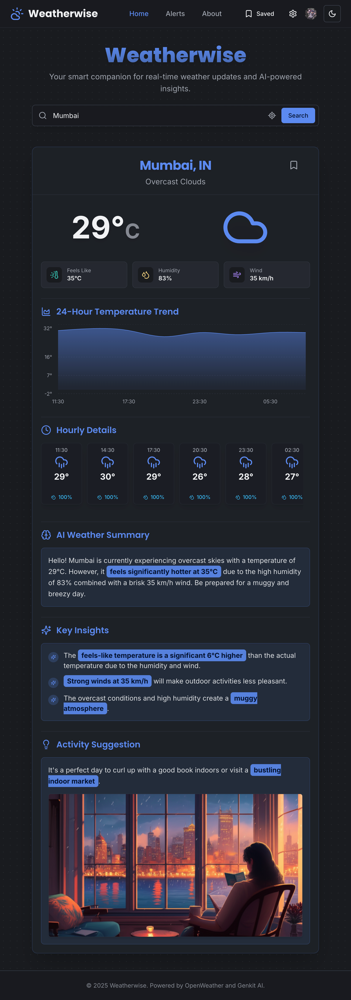

# Weatherwise: Intelligent Weather & Alert Platform

<div align="center">


</div>

<br/>

<div align="center">
  &nbsp;&nbsp;
  
</div>

**Weatherwise** is a modern, full-stack web application that provides real-time weather data, AI-powered insights, and a highly customizable, intelligent alert system. It's built with a modern tech stack designed for performance, scalability, and a superior developer experience.

---

## ✨ Core Features

*   **Dynamic Weather Dashboard:** Get real-time weather data for any city worldwide, with an interactive hourly forecast.
*   **AI-Powered Search & Insights:**
    *   **Intelligent Search:** Our AI understands natural language, corrects typos, and interprets complex queries like landmarks or businesses (e.g., `"weather at the eiffel tower"`). Live weather data is shown directly in the search suggestions.
    *   **Conversational Summaries:** Get friendly, easy-to-read weather summaries and creative activity suggestions tailored to the current conditions.
*   **Synced & Personalized Experience:**
    *   **Cross-Device Sync:** Your favorite cities, unit preferences, and default location are saved to your account and sync seamlessly across all your devices.
    *   **Customizable Display:** Choose between Celsius/Fahrenheit, km/h/mph, and 12/24-hour time formats.
    *   **Default Location:** Set a default city to load automatically every time you open the app.
*   **Intelligent, Customizable Alerts:**
    *   **AI-Driven Decisions:** The AI analyzes weather conditions to decide if an alert is significant enough to send.
    *   **Custom Schedules & Sensitivity:** Define specific days, times, and a timezone to receive alerts, and control notification frequency to prevent fatigue.
*   **Live Favorites Dashboard:** Your "Favorites" dropdown shows live weather for all your saved cities at a glance and allows you to set any favorite as your primary alert city with one click.
*   **Secure User Authentication:** Full sign-up, sign-in, and profile management powered by Clerk.
*   **Modern, Responsive UI:** A polished, responsive interface built with Tailwind CSS and ShadCN UI, featuring light and dark modes.

---

## 🚀 Getting Started

Follow these steps to get the project running on your local machine.

### 1. Prerequisites
Before you begin, you must have **Git** and **Node.js** (the latest Long-Term Support version is recommended) installed on your system.

#### Recommended: Install via a Version Manager
The most reliable way to install and manage Node.js versions is with a version manager. This is the recommended approach for all operating systems because it makes it easy to switch between different Node.js versions for different projects.

**Step 1: Install `nvm` (Node Version Manager)**

First, you need to install `nvm`. This tool manages your Node.js installations.
*   **On macOS or Linux:** Follow the official installation instructions on the [**nvm GitHub page**](https://github.com/nvm-sh/nvm#installing-and-updating). This usually involves running a single script in your terminal.
*   **On Windows:** Use the installer for [**nvm-for-windows**](https://github.com/coreybutler/nvm-for-windows#installation--upgrades).

> **⚠️ Important:** After installing `nvm`, you **must close and reopen your terminal window** for the `nvm` command to become available.

**Step 2: Install Node.js LTS**

Once `nvm` is installed and you've opened a new terminal, you can install the latest Long-Term Support (LTS) version of Node.js with this command:
```bash
# Installs and uses the latest LTS version of Node.js
nvm install --lts
```
This single command handles both installing and setting the new version as the one to use.

**Step 3: Install Git**

If you don't already have Git installed, download it from the [**official Git website**](https://git-scm.com/downloads).

---

#### Alternative: Direct Installation (Not Recommended)
If you prefer not to use a version manager, you can install Node.js and Git directly. However, this can make it more difficult to switch versions later.

**On macOS:**
The easiest way to install is using [Homebrew](https://brew.sh/):
```bash
# Install Homebrew if you don't have it
/bin/bash -c "$(curl -fsSL https://raw.githubusercontent.com/Homebrew/install/HEAD/install.sh)"

# Install Node.js (LTS) and Git
brew install node git
```

**On Windows:**
The most straightforward method is using the official installers:
1.  Download and run the **"LTS"** installer for [**Node.js**](https://nodejs.org/en/download/).
2.  Download and run the installer for [**Git**](https://git-scm.com/download/win).
*Alternatively, using the [Chocolatey](https://chocolatey.org/) package manager:*
```powershell
# Install Chocolatey if you don't have it
Set-ExecutionPolicy Bypass -Scope Process -Force; [System.Net.ServicePointManager]::SecurityProtocol = [System.Net.ServicePointManager]::SecurityProtocol -bor 3072; iex ((New-Object System.Net.WebClient).DownloadString('https://community.chocolatey.org/install.ps1'))

# Install Node.js LTS and Git
choco install nodejs-lts git -y
```

**On Linux (Debian/Ubuntu):**
Using the standard `apt` repository often provides an outdated version. The recommended method is to use the repository provided by [NodeSource](https://github.com/nodesource/distributions).
```bash
# 1. Download and run the NodeSource setup script for the latest LTS version:
curl -fsSL https://deb.nodesource.com/setup_lts.x | sudo -E bash -

# 2. Install Node.js and Git:
sudo apt-get install -y nodejs git
```
*(For other Linux distributions, please check their documentation for installing a recent LTS version of Node.js.)*

---

### 2. Project Setup

**Step 1: Clone the Repository**
```bash
git clone <YOUR_REPOSITORY_URL>
cd <project-directory>
```

**Step 2: Configure Environment Variables**
> **⚠️ IMPORTANT:** This is the most critical step. The application **will not start** without the required API keys.

1.  In the root directory, create a new file named `.env`.
2.  Add the following variables, replacing the placeholder values with your own keys.

| Variable                          | Description                                                                                                                                                             | How to Get It                                                                                                                                                                |
| :-------------------------------- | :---------------------------------------------------------------------------------------------------------------------------------------------------------------------- | :--------------------------------------------------------------------------------------------------------------------------------------------------------------------------- |
| `NEXT_PUBLIC_CLERK_PUBLISHABLE_KEY` | Public key for Clerk authentication.                                                                                                                                    | Go to your **Clerk Dashboard** -> **API Keys**.                                                                                                                              |
| `CLERK_SECRET_KEY`                | Secret key for Clerk authentication.                                                                                                                                    | Go to your **Clerk Dashboard** -> **API Keys**.                                                                                                                              |
| `NEXT_PUBLIC_OPENWEATHER_API_KEYS`| One or more API keys for OpenWeatherMap. **Multiple keys can be added, separated by commas**, for resilience.                                                              | Sign up on the **OpenWeatherMap** website and subscribe to the free "Current Weather and Forecasts" plan.                                                                    |
| `GEMINI_API_KEYS`                 | One or more API keys for the Google Gemini model. **Multiple keys can be added, separated by commas**, for resilience.                                                     | Go to **Google AI Studio** and click "Get API key".                                                                                                                          |
| `CRON_SECRET`                     | A secret password of your choice to protect the cron job endpoint. Should be a long, random string.                                                                       | Create your own secure password.                                                                                                                                             |
| `EMAIL_USER`                      | Your full Gmail address for sending email alerts.                                                                                                                         | This is your standard Gmail account (e.g., `youremail@gmail.com`).                                                                                                           |
| `EMAIL_PASSWORD`                  | A **16-digit App Password** for your Gmail account. Your regular password will not work.                                                                                  | Go to your **Google Account settings** -> **Security** -> **2-Step Verification**. Scroll down to "App passwords" and generate a new one. [See Google's instructions](https://support.google.com/accounts/answer/185833). |
| `EMAIL_FROM`                      | The email address alerts will appear to be sent from. Can be the same as `EMAIL_USER`.                                                                                    | Your choice, but usually the same as `EMAIL_USER`.                                                                                                                           |
| `NEXT_PUBLIC_BASE_URL`            | The public URL of your application.                                                                                                                                     | For local development, this is `http://localhost:3000`. For a deployed app, this will be your Firebase URL.                                                                  |

**Step 3: Install Dependencies & Run**
```bash
# This command installs all the necessary packages defined in package.json
# It will automatically fetch the correct, compatible versions.
npm install

# This starts the local development server
npm run dev
```

Your application should now be running at `http://localhost:3000`.

---

## ☁️ Deployment

This app is pre-configured for one-command deployment with **Firebase App Hosting**.

#### 1. Set Up Firebase
If you don't have them already, install the Firebase command-line tools and log in:
```bash
# Install the Firebase CLI globally
npm install -g firebase-tools

# Log in to your Google account
firebase login
```
You will also need to create a new project in the [Firebase Console](https://console.firebase.google.com/).

#### 2. Deploy the App
From your project's root directory, run the deploy command.
```bash
firebase deploy
```

#### 3. Configure Server Secrets
> **⚠️ CRITICAL STEP:** Your local `.env` file is **not** uploaded during deployment. Your app **will not work** until you add your secrets to the Firebase environment.

1.  Go to your project in the [Firebase Console](https://console.firebase.google.com/).
2.  Navigate to the **App Hosting** section.
3.  In your backend's settings, find the **Secret Manager** section and add all the same secret keys that are in your local `.env` file.
4.  **Important:** Update the `NEXT_PUBLIC_BASE_URL` variable to your new public Firebase URL.

---

## ⏰ Setting up Automatic Hourly Alerts (Cron Job)

To enable automatic hourly alerts, you must set up a "cron job" that calls a secure API endpoint on your **deployed application**.

1.  **Set `CRON_SECRET`:** Ensure you have added a secure `CRON_SECRET` in your Firebase project's Secret Manager.
2.  **Use a Scheduling Service:** Use a free external service like `cron-job.org`.
3.  **Configure the Job:**
    *   **URL:** `https://<YOUR_DEPLOYED_APP_URL>/api/cron`
    *   **Schedule:** Run **once every hour**.
    *   **HTTP Method:** `GET`
    *   **Custom Headers:** You must add an `Authorization` header with the value `Bearer <YOUR_CRON_SECRET>`.

### How to Verify
Check your application's logs in the Firebase Console. If you see the log message `[CRON-AUTH-SUCCESS] Cron job authorized successfully`, it's working!
```

