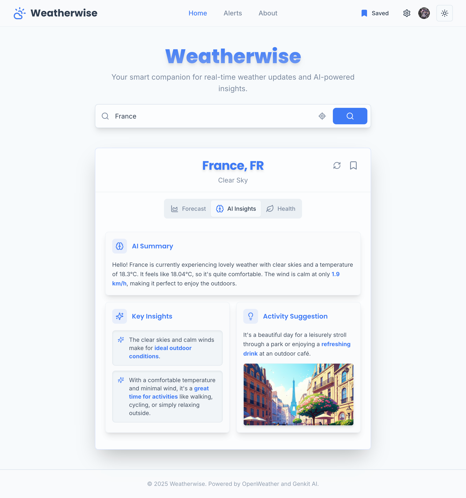
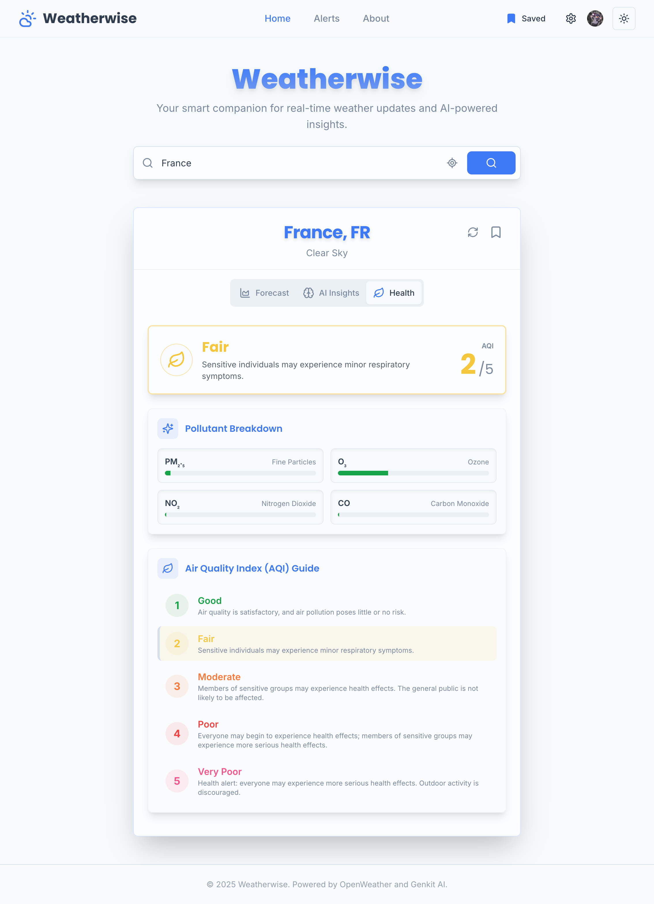

# Weatherwise: Intelligent Weather & Alert Platform

<div align="center">


</div>

<br/>

**Weatherwise** is a modern, full-stack web application that provides real-time weather data, AI-powered insights, and a highly customizable, intelligent alert system. It's built with a modern tech stack designed for performance, scalability, and a superior developer experience.

<div align="center">
  <p>
    &nbsp;&nbsp;
    
  </p>
  <p>
    
  </p>
</div>

---

## ✨ Core Features

*   **🌐 Dynamic Weather Dashboard:** Get real-time weather data for any city worldwide, complete with an interactive hourly forecast and beautiful data visualizations.
*   **🧠 AI-Powered Search & Insights:**
    *   **Intelligent Search:** Our AI understands natural language, corrects typos, and interprets complex queries like landmarks or businesses (e.g., `"weather at the eiffel tower"`).
    *   **Conversational Summaries:** Get friendly, easy-to-read weather summaries and creative activity suggestions tailored to the current conditions.
    *   **Visual Weather Story:** A unique, AI-generated image brings the weather and activity suggestion to life for a more immersive experience.
*   **☁️ Synced & Personalized Experience:**
    *   **Cross-Device Sync:** Your saved locations, unit preferences, and default location are saved to your account and sync seamlessly across all your devices.
    *   **Customizable Display:** Choose between Celsius/Fahrenheit, km/h/mph, and 12/24-hour time formats.
*   **🔔 Intelligent, Customizable Alerts:**
    *   **AI-Driven Decisions:** An AI agent analyzes weather conditions to decide if an alert is significant enough to send, preventing notification fatigue.
    *   **Custom Schedules & Sensitivity:** Define specific days, times, and a timezone to receive alerts, and control notification frequency.
*   **🚶 Proactive Location Alerts:** As you move, Weatherwise can automatically check the weather at your new location and notify you of significant changes, keeping you prepared on the go.
*   **🔖 Live Saved Locations:** Your "Saved Locations" dropdown shows live weather for all your saved cities at a glance and allows you to set any location as your primary alert city with one click.
*   **🔒 Secure User Authentication:** Full sign-up, sign-in, and profile management powered by Clerk.
*   **🎨 Modern, Responsive UI:** A polished, responsive interface built with Tailwind CSS and ShadCN UI, featuring beautifully matched light and dark modes.

---

## 🛠️ Built With

Weatherwise is built with a modern tech stack designed for performance, scalability, and a superior developer experience:

| Technology | Role |
| :--- | :--- |
| **Next.js** | Full-stack React framework with App Router |
| **React & TypeScript**| Core UI library and language |
| **Tailwind CSS & ShadCN UI** | Styling and component library |
| **Genkit & Gemini**| Generative AI flows and models |
| **Firebase App Hosting** | Deployment and hosting |
| **Clerk** | User authentication and management |
| **Nodemailer** | Email alert delivery |

---

## 🚀 Getting Started

Follow these steps to get the project running on your local machine.

### 1. Prerequisites
You will need **Git** and **Node.js** (latest LTS version recommended) installed on your system. The most reliable way to install Node.js is with a version manager.

1.  **Install Git:** Download and install from the [**official Git website**](https://git-scm.com/downloads).
2.  **Install a Node Version Manager:**
    *   **macOS / Linux:** Install [**nvm**](https://github.com/nvm-sh/nvm) by running: `curl -o- https://raw.githubusercontent.com/nvm-sh/nvm/v0.39.7/install.sh | bash`
    *   **Windows:** Install [**nvm-for-windows**](https://github.com/coreybutler/nvm-for-windows) using the latest release installer.
3.  **Install & Use Node.js:** After installing nvm, **close and reopen your terminal**, then run:
    ```bash
    nvm install --lts
    ```
    > **Note:** The Node Package Manager (`npm`) is included automatically with Node.js. You do not need to install it separately.
4.  **(Optional) Update npm:** For best performance and compatibility, it's recommended to update `npm` to its latest version:
    ```bash
    npm install -g npm@latest
    ```

---

### 2. Project Setup

**Step 1: Clone the Repository**
```bash
git clone <YOUR_REPOSITORY_URL>
cd <project-directory>
```

**Step 2: Configure Environment Variables**
> **⚠️ IMPORTANT:** This is the most critical step. The application **will not start** without the required API keys. If you see an error like `Missing publishableKey` when you run the app, it means your `.env` file is missing or incomplete.

1.  In the root directory, create a new file named `.env`.
2.  Add the following variables, replacing the placeholder values with your own keys.

| Variable                          | Description                                                                                                                                                             | How to Get It                                                                                                                                                                |
| :-------------------------------- | :---------------------------------------------------------------------------------------------------------------------------------------------------------------------- | :--------------------------------------------------------------------------------------------------------------------------------------------------------------------------- |
| `NEXT_PUBLIC_CLERK_PUBLISHABLE_KEY` | Public key for Clerk authentication.                                                                                                                                    | Go to your **Clerk Dashboard** -> **API Keys**.                                                                                                                              |
| `CLERK_SECRET_KEY`                | Secret key for Clerk authentication.                                                                                                                                    | Go to your **Clerk Dashboard** -> **API Keys**.                                                                                                                              |
| `NEXT_PUBLIC_OPENWEATHER_API_KEYS`| One or more API keys for OpenWeatherMap. **Multiple keys can be added, separated by commas**, for resilience.                                                              | Sign up on the **OpenWeatherMap** website and subscribe to the free "Current Weather and Forecasts" plan.                                                                    |
| `GEMINI_API_KEYS`                 | One or more API keys for the Google Gemini model. **Multiple keys can be added, separated by commas**, for resilience.                                                     | Go to **Google AI Studio** and click "Get API key".                                                                                                                          |
| `CRON_SECRET`                     | A secret password of your choice to protect the cron job endpoint. Should be a long, random string.                                                                       | Create your own secure password.                                                                                                                                             |
| `EMAIL_USER`                      | Your full Gmail address for sending email alerts.                                                                                                                         | This is your standard Gmail account (e.g., `youremail@gmail.com`).                                                                                                           |
| `EMAIL_PASSWORD`                  | A **16-digit App Password** for your Gmail account. Your regular password will not work.                                                                                  | Go to your **Google Account settings** -> **Security** -> **2-Step Verification**. Scroll down to "App passwords" and generate a new one. [See Google's instructions](https://support.google.com/accounts/answer/185833). |
| `EMAIL_FROM`                      | The email address alerts will appear to be sent from. Can be the same as `EMAIL_USER`.                                                                                    | Your choice, but usually the same as `EMAIL_USER`.                                                                                                                           |
| `NEXT_PUBLIC_BASE_URL`            | The public URL of your application.                                                                                                                                     | For local development, this is `http://localhost:3000`. For a deployed app, this will be your Firebase URL.                                                                  |

**Step 3: Install Dependencies & Run**
```bash
# This command installs all the necessary packages defined in package.json
# It will automatically fetch the correct, compatible versions.
npm install

# This starts the local development server
npm run dev
```

Your application should now be running at `http://localhost:3000`.

---

## ☁️ Deployment

This app is pre-configured for one-command deployment with **Firebase App Hosting**.

#### 1. Set Up Firebase
If you don't have them already, install the Firebase command-line tools and log in:
```bash
# Install the Firebase CLI globally
npm install -g firebase-tools

# Log in to your Google account
firebase login
```
You will also need to create a new project in the [Firebase Console](https://console.firebase.google.com/).

#### 2. Deploy the App
From your project's root directory, run the deploy command.
```bash
firebase deploy
```

#### 3. Configure Server Secrets
> **⚠️ CRITICAL STEP:** Your local `.env` file is **not** uploaded during deployment. Your app **will not work** until you add your secrets to the Firebase environment.

1.  Go to your project in the [Firebase Console](https://console.firebase.google.com/).
2.  Navigate to the **App Hosting** section.
3.  In your backend's settings, find the **Secret Manager** section and add all the same secret keys that are in your local `.env` file.
4.  **Important:** Update the `NEXT_PUBLIC_BASE_URL` variable to your new public Firebase URL.

---

## ⏰ Setting up Automatic Hourly Alerts (Cron Job)

To enable automatic hourly alerts, you must set up a "cron job" that calls a secure API endpoint on your **deployed application**.

1.  **Set `CRON_SECRET`:** Ensure you have added a secure `CRON_SECRET` in your Firebase project's Secret Manager.
2.  **Use a Scheduling Service:** Use a free external service like `cron-job.org`.
3.  **Configure the Job:**
    *   **URL:** `https://<YOUR_DEPLOYED_APP_URL>/api/cron`
    *   **Schedule:** Run **once every hour**.
    *   **HTTP Method:** `GET`
    *   **Custom Headers:** You must add an `Authorization` header with the value `Bearer <YOUR_CRON_SECRET>`.

### How to Verify
Check your application's logs in the Firebase Console. If you see the log message `[CRON-AUTH-SUCCESS] Cron job authorized successfully`, it's working!

    